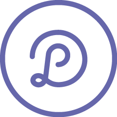

<!--
*** Thanks for checking out the Best-README-Template. If you have a suggestion
*** that would make this better, please fork the repo and create a pull request
*** or simply open an issue with the tag "enhancement".
*** Don't forget to give the project a star!
*** Thanks again! Now go create something AMAZING! :D
-->

<!-- PROJECT SHIELDS -->
<!--
*** I'm using markdown "reference style" links for readability.
*** Reference links are enclosed in brackets [ ] instead of parentheses ( ).
*** See the bottom of this document for the declaration of the reference variables
*** for contributors-url, forks-url, etc. This is an optional, concise syntax you may use.
*** https://www.markdownguide.org/basic-syntax/#reference-style-links
-->
[![Contributors][contributors-shield]][contributors-url]
[![Forks][forks-shield]][forks-url]
[![Stargazers][stars-shield]][stars-url]
[![Issues][issues-shield]][issues-url]
[![LinkedIn][linkedin-shield]][linkedin-url]

<!-- PROJECT LOGO -->
 

  

<h3 align="center">My Portfolio</h3>

  

    Welcome to my portfolio. I am a Front-End Developer with 10+ years graphic design background.  have experience with HTML, CSS, JavaScript, and looking to grow as a Fullstack Web Developer building applications using MERN stack (MongoDB, Express.js, React.js, Node.js) 
     
    <a href="https://github.com/dlongodev/my-portfolio"><strong>Explore the docs »</strong></a>
     
     
    <a href="https://dlongo.dev">View Demo</a>
    ·
    <a href="https://github.com/dlongodev/my-portfolio/issues">Report Bug</a>
    ·
    <a href="https://github.com/dlongodev/my-portfolio/issues">Request Feature</a>
  

<!-- TABLE OF CONTENTS -->

  
Table of Contents

  <ol>
    <li>
      <a href="#about-the-project">About The Project</a>
      <ul>
        <li><a href="#built-with">Built With</a></li>
      </ul>
    </li>
    <li><a href="#contact">Contact</a></li>
    <li><a href="#acknowledgments">Acknowledgments</a></li>
  </ol>

<!-- ABOUT THE PROJECT -->
## About The Project

[![Product Name Screen Shot][product-screenshot]](https://example.com)

(<a href="#top">back to top</a>)

### Built With

* [Vanilla JavaScript](https://developer.mozilla.org/en-US/docs/Web/JavaScript)
* [HTML5](https://developer.mozilla.org/en-US/docs/Web/HTML)
* [Sass / SCSS](https://sass-lang.com/)
* [Parcel](https://parceljs.org/languages/sass/)
* [Open-Props](https://open-props.style/)

(<a href="#top">back to top</a>)

<!-- CONTACT -->
## Contact

Daniele Longo - [@dlongodev](https://twitter.com/dlongodev) - dlongodev@gmail.com.com

Project Link: [https://github.com/dlongodev/my-portfolio](https://github.com/dlongodev/my-portfolio)

(<a href="#top">back to top</a>)

<!-- ACKNOWLEDGMENTS -->
## Acknowledgments

* [Grammerhub](http://grammerhub.org/)
* [General Assembly](https://generalassemb.ly/)
* [Twitter Dev Community](https://twitter.com/hashtag/DEVCommunity)

(<a href="#top">back to top</a>)

<!-- MARKDOWN LINKS & IMAGES -->
<!-- https://www.markdownguide.org/basic-syntax/#reference-style-links -->
[contributors-shield]: https://img.shields.io/github/contributors/dlongodev/my-portfolio.svg?style=for-the-badge
[contributors-url]: https://github.com/dlongodev/my-portfolio/graphs/contributors
[forks-shield]: https://img.shields.io/github/forks/dlongodev/my-portfolio.svg?style=for-the-badge
[forks-url]: https://github.com/dlongodev/my-portfolio/network/members
[stars-shield]: https://img.shields.io/github/stars/dlongodev/my-portfolio.svg?style=for-the-badge
[stars-url]: https://github.com/dlongodev/my-portfolio/stargazers
[issues-shield]: https://img.shields.io/github/issues/dlongodev/my-portfolio.svg?style=for-the-badge
[issues-url]: https://github.com/dlongodev/my-portfolio/issues
[license-shield]: https://img.shields.io/github/license/dlongodev/my-portfolio.svg?style=for-the-badge
[license-url]: https://github.com/dlongodev/my-portfolio/blob/master/LICENSE.txt
[linkedin-shield]: https://img.shields.io/badge/-LinkedIn-black.svg?style=for-the-badge&logo=linkedin&colorB=555
[linkedin-url]: https://linkedin.com/in/danielealongo
[product-screenshot]: img/screenshot.png
